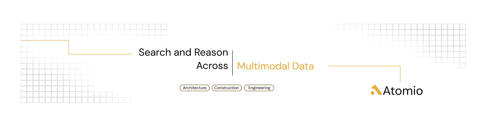

# Hello there, we are [Atomio](https://atomioai.com)! 👋

**AI Project intelligence layer for long-running work in architecture, engineering, and construction.**

Atomio is a project intelligence platform for complex, long-running AEC work. It unifies documents, images, and
multimodal data into a secure, conversational workspace, helping teams navigate complexity and make informed decisions
across the full project lifecycle.

---

## Who are We?

We are Ana and Alex, two software engineers and friends who love building products that solve real-life problems.
Our plan is to empower the people who design and build the (physical) world around us. We believe that architecture,
engineering, and construction are some of the most impactful industries out there, and people working in these fields
deserve better tools to do their jobs.

## 🚀 What We Do

Long-running projects accumulate context across documents, drawings, images, and conversations. Over time, this
information fragments, making it difficult to understand decisions, dependencies, and history.

Atomio brings this context together and makes it accessible through a conversational interface, grounded in your actual
project data. This helps teams avoid rework, reduce errors, and make informed decisions faster. The result? Better
projects, delivered on time and within budget. Long-term project success, made easier.

---

## 👥 Who It's For

- Architecture practices
- Engineering consultancies
- Construction and infrastructure teams

---

## 📬 Get in Touch

- 🌐 https://www.atomioai.com
- 📅 Book a demo: https://www.cal.eu/alexradumoraru/atomio-demo
- 📧 [hello@atomioai.com](mailto:hello@atomioai.com)

© 2026 Atomio. All rights reserved.
